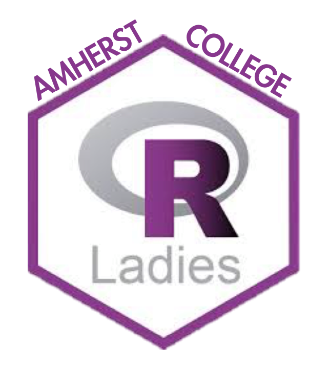

# RLadies

RLadies is a group that promotes gender inclusivity in statistics and data science at Amherst. We will be holding multiple events throughout the semester, including speakers, panels, and more. All are welcome to attend these events!

[RLadies](https://rladies.org) is a world-wide organization to promote gender diversity in the R community.  

# Events for Spring 2020

We will keep this section updated over the course of the semester. Refreshments are provided at all events!

## Amy Nussbaum: Visualizing Data Through Maps
Amy Nussbaum is a Professor of Statistics at Mount Holyoke College. She will be giving a talk about data visualization with maps. 

## Brittney Bailey and Katharine Correia: Panel on Careers in Statistics and Data Science
Brittney Bailey and Katharine Correia are both professors at Amherst College. They will be speaking about their academic journies in statistics. This event is in the form of a panel, so feel free to come with questions.

## Krista Gile -- CANCELLED
Tuesday, March 10, 4:30-5:30

Krista Gile, Professor in the Mathematics and Statistics Department at UMass Amherst, will be discussing her personal journey interwoven with her research. Professor Giles' research focuses on creating a statistical methodology for social and behavioral science research, particularly related to making inference from partially-observed social network structures.

## Sara Stoudt
Monday, April 13, 4:00-5:00

Sara Stoudt, a former Smith College student, will be giving an overview of her work and then doing a question and answer about career opportunities. Sara now does research in Applied and Theoretical Statistics at the University of California, Berkeley.

## Dana Udwin
Wednesday, April 22, 4:00-5:00

Dana Udwin, a Smith College alumna and third-year Biostatistics PhD student at Brown University, reflects on industry and graduate school in statistics and data science. As a graduate of the MassMutual Data Science Development Program, a program in which she worked as a data scientist and pursued a master's in statistics from UMass Amherst, Dana has a unique perspective on industry and academia.

## Contact information

- Andrea Boskovic, aboskovic21@amherst.edu
- Clara Seo, cseo21@amherst.edu
- Nicholas Horton (faculty liaison)

Last updated March 3, 2020
